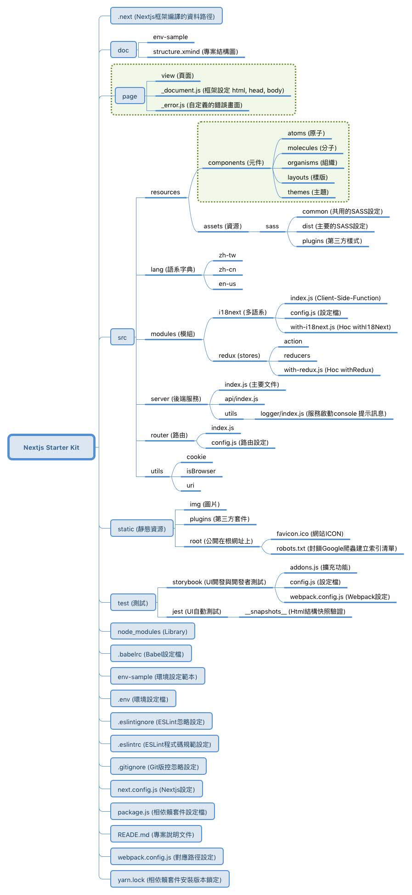

# Nextjs 5 Starter Kit

This starting template uses Nextjs 5, and selects the official examples provided by our commonly used requirements to form a basic puzzle.

## Feature
- Server Side Render - Nextjs 5
- Multilingual Department - i18next
- style management
  - ESLint
  - Jest
  - Jest Snapshots
  - prop-types & Flow(未設定)
  - Styled-component
  - SCSS
  - nprogress
  - Storybook
  - Bootstrap-4-Scss
  - Redux
- Serverless
  - helmet
  - Express
  -json-server
  
  
